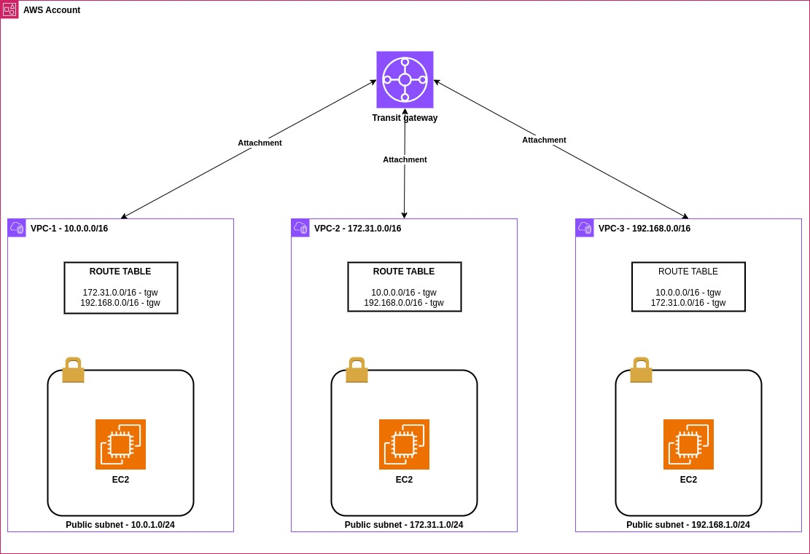

# Terraform - Conectando VPCs com o AWS Transit Gateway
Esse documento demonstra como interconectar VPCs em uma mesma **account** com o AWS Transit Gateway utilizando o Terraform para provisionar os recursos.

A arquitetura utilizada nesse tutorial será a demonstrada na figura abaixo:



Conforme demonstrado na figura acima, teremos três VPCs, com CIDR blocks diferentes, e conectadas atrvés de um transit gateway.

* VPC-1: 10.0.0.0/16 (public subnet: 10.0.1.0/24)
* VPC-2: 172.31.0.0/16 (public subnet: 172.31.1.0/24)
* VPC-3: 192.168.0.0/16 (public subnet: 192.168.1.0/24)

> **Nota:** Como podemos ver, devido a esse documento ser um laboratório e ter o intuito apenas de demonstrar como fazer, teremos somente subnets públicas.

## Requisitos
Antes de iniciarmos o processo de provisionamento, temos que preencher alguns requisitos:

* Crie um usuário no IAM com permissões suficientes para que o Terraform possa provisionar os recursos desse manual
* Crie uma **access key** para esse usuário criado
* Configure a autenticação da sua estação de trabalho na AWS, utilizando a access key criada no passo anterior com a ferramenta [AWS CLI](https://docs.aws.amazon.com/pt_br/cli/latest/userguide/getting-started-install.html).
* Crie três keypairs na sua conta AWS, um para cada instância, chamados **vpc-1**, **vpc-2** e **vpc-3**. Eles serão usados para logarmos via SSH nas instâncias e testar a conectividade entre as VPCs. Para mais detalhes, veja a [Documentação oficial](https://docs.aws.amazon.com/pt_br/AWSEC2/latest/UserGuide/ec2-key-pairs.html).

## Provisionando o ambiente
Agora vamos provisionar os recursos necessários:

```
terraform init
terraform plan
```

Se não houverem erros na saída dos comandos acima, rode o apply:

```
terraform apply
```

## Testando a conectividade
Após o término do processo de provisionamento, teremos trẽs instâncias EC2 iniciadas, uma em cada VPC. Logue em cada uma delas via SSH e teste a conectividade entre elas normalmente via shell.